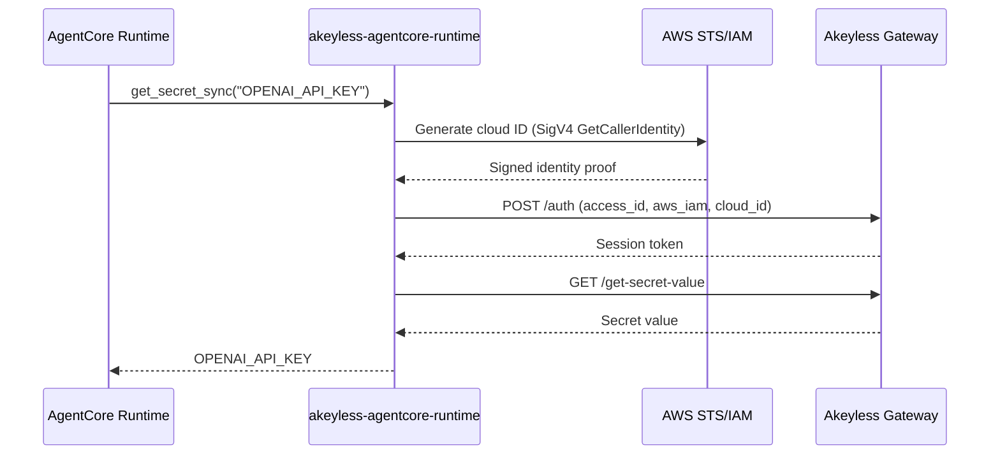

# akeyless-agentcore-runtime

Fetch [Akeyless](https://www.akeyless.io) secrets at **runtime** on [AWS Bedrock AgentCore](https://aws.amazon.com/bedrock/agentcore/). Authenticate with **cloud identity** (AWS IAM) — no long-lived API keys in your agent deployment. Application secrets stay in Akeyless, not AWS Secrets Manager.

**Repository:** [github.com/akeyless-community/bedrock-agentcore-akeyless-runtime](https://github.com/akeyless-community/bedrock-agentcore-akeyless-runtime)

## Documentation

| Guide | Description |
|-------|-------------|
| **[Installation](docs/INSTALL.md)** | **pip install — no git clone required** |
| [Akeyless setup](docs/AKEYLESS_SETUP.md) | Auth method, RBAC, secret paths — do this first |
| [Deployment patterns](docs/DEPLOYMENT.md) | In-agent fetch, hybrid, MCP server, Gateway Lambda |
| [Examples](examples/README.md) | Runnable sample agents |
| [Security](SECURITY.md) | Production checklist and reporting |
| [Contributing](CONTRIBUTING.md) | Development setup and PR guidelines |

## Why this integration?

| Concern | AWS default pattern | This integration |
|---------|--------------------|------------------|
| **Authentication to secrets platform** | IAM role → Secrets Manager | IAM role → Akeyless (AWS IAM auth method) |
| **Secret storage** | AWS Secrets Manager | Akeyless (static, dynamic, rotated) |
| **Bootstrap credentials** | None (IAM only) | Only `AKEYLESS_ACCESS_ID` (no secret key) |
| **Rotation & governance** | Secrets Manager policies | Akeyless RBAC, rotation, audit |

AgentCore Runtime provides an IAM execution role with ambient AWS credentials. This library uses those credentials to generate an Akeyless **cloud ID** and authenticate — the same pattern used by EKS, Lambda, and other Akeyless integrations.

## Install

**No git clone needed.** Add to your agent project and install with pip.

### From PyPI (when published)

```bash
pip install akeyless-agentcore-runtime
```

### From GitHub (available now)

```bash
pip install "akeyless-agentcore-runtime @ git+https://github.com/akeyless-community/bedrock-agentcore-akeyless-runtime.git@v0.2.0"
```

Add to your AgentCore `requirements.txt`:

```text
akeyless-agentcore-runtime @ git+https://github.com/akeyless-community/bedrock-agentcore-akeyless-runtime.git@v0.2.0
bedrock-agentcore>=0.1.0
```

Full install guide (extras, MCP CLI, verification): **[docs/INSTALL.md](docs/INSTALL.md)**

Optional extras:

```bash
pip install "akeyless-agentcore-runtime[strands] @ git+https://github.com/akeyless-community/bedrock-agentcore-akeyless-runtime.git@v0.2.0"
pip install "akeyless-agentcore-runtime[mcp] @ git+https://github.com/akeyless-community/bedrock-agentcore-akeyless-runtime.git@v0.2.0"
pip install "akeyless-agentcore-runtime[gateway] @ git+https://github.com/akeyless-community/bedrock-agentcore-akeyless-runtime.git@v0.2.0"
pip install "akeyless-agentcore-runtime[all] @ git+https://github.com/akeyless-community/bedrock-agentcore-akeyless-runtime.git@v0.2.0"
```

Requires **Python 3.10+**.

## Quick start

### 1. Configure Akeyless

Follow the full guide: **[docs/AKEYLESS_SETUP.md](docs/AKEYLESS_SETUP.md)**

Summary:

1. Create an **AWS IAM Auth Method** bound to your AgentCore execution role ARN
2. Grant read/list on `/bedrock-agentcore/<agent>/<env>/*`
3. Store secrets in Akeyless (not in AgentCore env vars)

### 2. Set bootstrap env vars on AgentCore

Configure only auth + path prefix — **not** application secrets:

| Variable | Required | Example |
|----------|----------|---------|
| `AKEYLESS_ACCESS_ID` | Yes | `p-xxxxx` |
| `AKEYLESS_ACCESS_TYPE` | No (default: `aws_iam`) | `aws_iam` |
| `AKEYLESS_SECRET_PREFIX` | Recommended | `/bedrock-agentcore/my-agent/production` |
| `AKEYLESS_GATEWAY_URL` | No | `https://api.akeyless.io` |
| `AGENTCORE_AGENT_NAME` | No | `my-agent` |

### 3. Fetch a secret in your agent

```python
from akeyless_agentcore import get_secret_sync

api_key = get_secret_sync("OPENAI_API_KEY")
```

### 4. Deploy

```bash
pip install akeyless-agentcore-runtime bedrock-agentcore
agentcore deploy
```

See [examples/strands-agent/](examples/strands-agent/) for a complete agent.

## In-agent fetch vs AgentCore tools

Use **both** in production — they solve different problems:

| Pattern | When to use | Example |
|---------|-------------|---------|
| **In-agent fetch** | Bootstrap secrets on every invocation; no tool-call overhead | Model API key at cold start |
| **AgentCore tools** | Agent decides which secret to fetch; shared across agents | `get_akeyless_secret("DATABASE_URL")` on demand |
| **Hybrid (recommended)** | Bootstrap + on-demand | [examples/hybrid-agent/](examples/hybrid-agent/) |

```python
from akeyless_agentcore import get_secret_sync
from akeyless_agentcore.tools.strands import create_strands_tools

api_key = get_secret_sync("OPENAI_API_KEY")          # bootstrap
agent = Agent(model=model, tools=create_strands_tools())  # on-demand
```

### Tool deployment options

| Deployment | Install extra | Use case |
|------------|---------------|----------|
| In-process Strands tools | `[strands]` | Tools in the same agent process |
| MCP server on AgentCore Runtime | `[mcp]` | Dedicated secrets MCP endpoint |
| Gateway Lambda target | `[gateway]` | Shared tools via AgentCore Gateway |

| Tool | Returns values? | Description |
|------|----------------|-------------|
| `list_akeyless_secrets` | No | Discover secret names under a prefix |
| `get_akeyless_secret` | Yes | Fetch static, dynamic, or rotated secret |

Full details: **[docs/DEPLOYMENT.md](docs/DEPLOYMENT.md)**

## API reference

### Convenience functions

```python
from akeyless_agentcore import get_secret_sync, get_secret

api_key = get_secret_sync("OPENAI_API_KEY")
api_key = await get_secret("OPENAI_API_KEY")  # async
```

### Client

```python
from akeyless_agentcore import AkeylessRuntimeClient

client = AkeylessRuntimeClient(
    gateway_url="https://api.akeyless.io",
    secret_prefix="/bedrock-agentcore/my-agent/production",
    access_id="p-xxxxx",
    access_type="aws_iam",
)

client.get_secret_sync("OPENAI_API_KEY")
client.get_secret_json_sync("APP_CONFIG")
client.get_dynamic_secret_sync("aws-creds")
client.get_rotated_secret_sync("api-key")
client.list_secrets_sync()
```

## Authentication

| Method | `AKEYLESS_ACCESS_TYPE` | Additional env |
|--------|------------------------|----------------|
| **AWS IAM (recommended)** | `aws_iam` | `AKEYLESS_ACCESS_ID` |
| Access key | `access_key` | `AKEYLESS_ACCESS_ID`, `AKEYLESS_ACCESS_KEY` |
| API key | `api_key` | `AKEYLESS_ACCESS_ID`, `AKEYLESS_ACCESS_KEY` |
| Universal Identity | `universal_identity` | `AKEYLESS_UID_TOKEN` |
| JWT | `jwt` | `AKEYLESS_ACCESS_ID`, `AKEYLESS_JWT` |
| Pre-authenticated | — | `AKEYLESS_TOKEN` |

## Architecture



## Local development

```bash
cp .env.example .env   # edit with your test credentials — never commit .env

export AKEYLESS_ACCESS_ID=p-xxxxx
export AKEYLESS_ACCESS_TYPE=access_key
export AKEYLESS_ACCESS_KEY=your-readonly-key
export AKEYLESS_SECRET_PREFIX=/bedrock-agentcore/my-agent/dev

python3 -c "from akeyless_agentcore import get_secret_sync; print(get_secret_sync('OPENAI_API_KEY')[:8] + '...')"
```

## Related community projects

- [netlify-akeyless-runtime](https://github.com/akeyless-community/netlify-runtime) — Netlify Functions
- [fly-akeyless-runtime](https://github.com/akeyless-community/fly-runtime) — Fly.io Machines
- [vercel-akeyless-runtime](https://github.com/akeyless-community/vercel-runtime) — Vercel serverless
- [heroku-akeyless-runtime](https://github.com/akeyless-community/heroku-runtime) — Heroku dynos

## License

Apache-2.0
